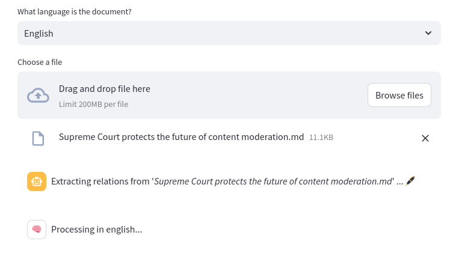
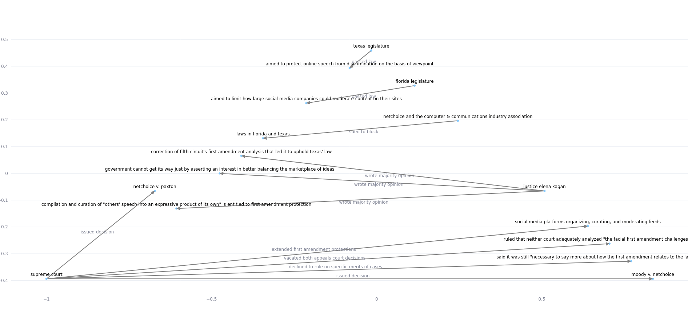
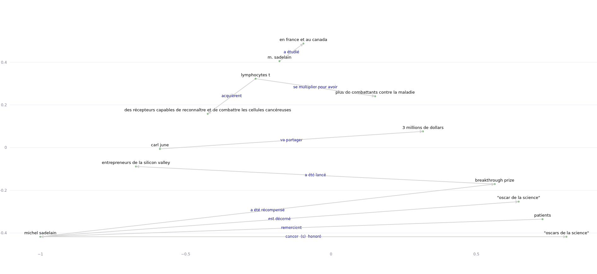

# Convertir archivo a grafo de conocimiento 🖊️

Convierte un archivo de texto en un grafo de conocimiento utilizando LLMs, ejecutándose con [Streamlit](https://streamlit.io/). 

## Requisitos ⚡ 

- [Ollama](https://ollama.com/download) instalado con [Llama3 instruct](https://ollama.com/library/llama3:instruct)
- Ollama ejecutándose en http://localhost:11434/

## Configuración 🗃️ 

Clona este repositorio, crea un entorno virtual, actívalo y crea la carpeta requerida:

```bash
git clone https://github.com/4l3x4ndre/LLM_knowledge_graph.git;
cd LLM_knowledge_graph ; python3 -m venv venv; source venv/bin/activate; mkdir saved_relations
```

Instala las dependencias:

```bash
pip install -r requirements.txt
```

Crea los modelos en inglés y francés:

```bash
ollama create relations_extraction_fr -f extraction_model_french.modelfile;
ollama create relations_extraction -f extraction_model.modelfile;
```

## Uso 🎉 

1. **Inicia el servidor**:

```bash
streamlit run 1_<tab>
```

Después de `1_`, presiona tab para usar el autocompletado (ya que streamlit usa emojis en los nombres de archivo).

2. **Elige el idioma del archivo.**
3. **Sube el archivo de texto o .md.**

A continuación, comenzará la recuperación de información:



4. **Se mostrará el grafo de conocimiento.**



Otro ejemplo:




## Fragmentación de documentos 🔬 

> Funciona solo para archivos markdown.

Se propone una opción para **dividir** el documento según sus encabezados de nivel 1.

Cuando el documento de entrada es demasiado grande, el modelo pierde precisión. Al alimentarlo parte por parte, lo obligamos a recuperar más relaciones. Los grafos de conocimiento serán así más precisos. Se creará **un** grafo de conocimiento **por cada parte**.

Con esta opción activada, la recuperación tardará más, ya que los prompts se enviarán uno tras otro.

## Interfaz de chat 💬

La barra lateral incluye una página para chatear directamente con el LLM (llama3).

## Más 📚 

- Los nodos se posicionan usando [NetworkX](https://networkx.org/) en un diseño planar si es posible, de lo contrario, en un diseño Kamada Kawai.
- Los grafos se muestran usando plotly y `streamlit.plotly_chart()`. El usuario puede así:
	- **acercar y alejar (zoom)**
	- **guardar el grafo como png**
	- **desplazarse**
- Al enviar un archivo ya procesado, el servidor preguntará si se debe recalcular la recuperación de información o **usar las relaciones existentes** (guardadas en la carpeta `saved_relations`).
- Si la fuente está presente en la etiqueta del enlace, la fuente se mencionará como "(s)" en la etiqueta del enlace; el destino como "(o)", de "objeto".
- Los modelos de **LLMs** se crean con [archivos de modelo de Ollama](https://github.com/ollama/ollama/blob/main/docs/modelfile.md).
