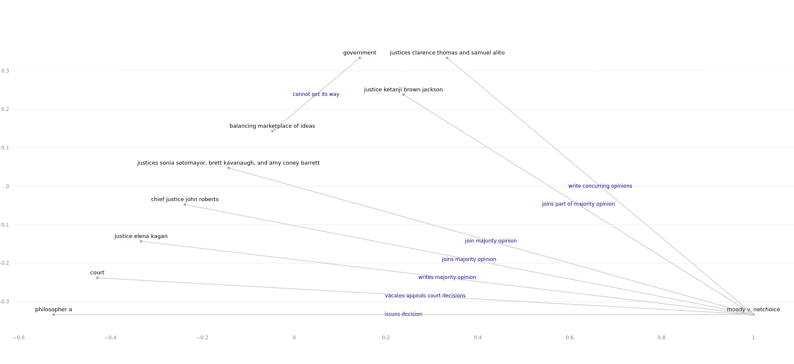

# Convert file to knowledge graph  🖊️

Convert a text file to a knowledge graph using LLMs, running with [Streamlit](https://streamlit.io/). 

## Requirements ⚡ 

- [Ollama](https://ollama.com/download) installed with [Llama3 instruct](https://ollama.com/library/llama3:instruct)
- Ollama running at http://localhost:11434/

## Setup  🗃️ 

Clone this repository, create a virtual environment, activate it, and create a required folder:

```bash
git clone https://github.com/4l3x4ndre/LLM_knowledge_graph.git;
cd LLM_knowledge_graph ; python3 -m venv venv; source venv/bin/activate; mkdir saved_relations
```

Install requirements:

```bash
pip install -r requirements.txt
```

Create english and french models:

```bash
ollama create relations_extraction_fr -f extraction_model_french.modelfile;
ollama create relations_extraction -f extraction_model.modelfile;
```

## Usage  🎉 

1. **Launch the server**:

```bash
streamlit run 1_<tab>
```

After `1_`, press tab to use the autocompletion (as streamlit uses emojis in filenames).

2. **Choose the language of the file.**
3. **Upload the text or md file.**

The information retrieval will then start:


4. **The knowledge graph will be displayed.**



Another example :


## Document fragmentation 🔬 

> Works only for markdown files.

An option is proposed to **divide** the document on its level 1 headings.

When the input document is too large, the model loses precision. By feeding it part by part, we force it to retrieve more relations. The knowledge graphs will thus be sharper. **One** knowledge graph will be created **per part**.

With this option enabled, the retrieval will thus take longer, as promprs will be given one after the other.

## Chat interface  💬

The sidebar include a page to chat directly with the LLM (llama3).

## More  📚 

- Nodes are positioned using [NetworkX](https://networkx.org/) in a planar layout if possible, otherwise in Kamada Kawai layout.
- Graphs are displayed using plotly and `streamlit.plotly_chart()`. The user can thus:
	- **zoom in and out**
	- **save the graph as png**
	- **move around**
- When submitting an already processed file, the server will ask to recompute information retrieval or **use existing relations** (saved under the `saved_relations` folder).
- If the source is present in the link's label, the source will be mentionned as "(s)" in the link's label -- the destination as "(o)", for "object".
- **LLMs** models are created with [Ollama model files](https://github.com/ollama/ollama/blob/main/docs/modelfile.md).


